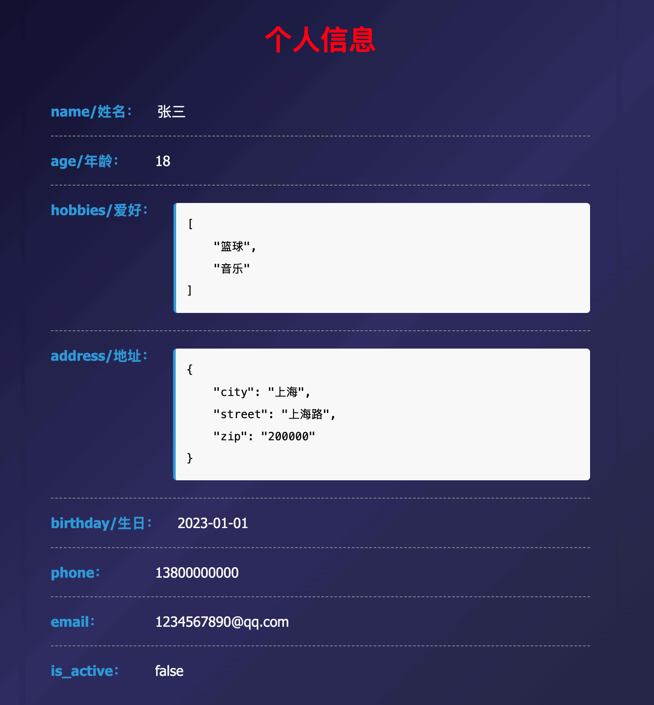
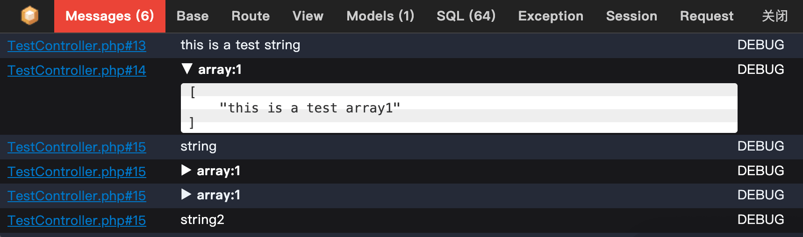
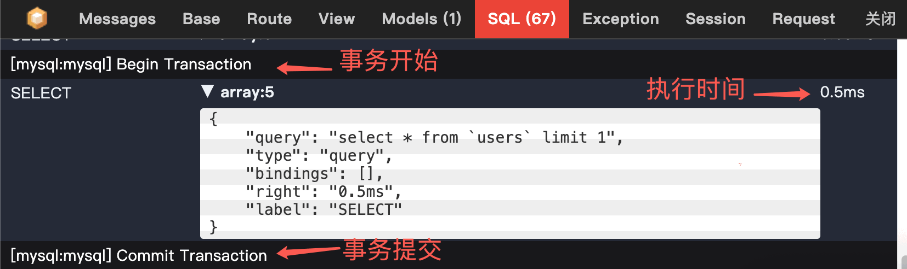
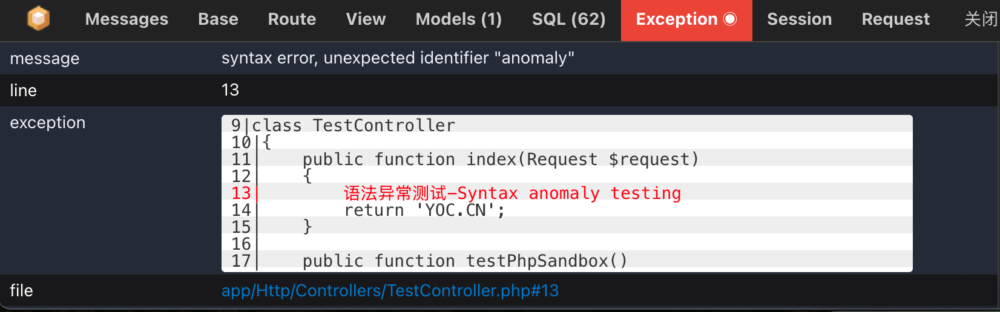

# 系统追踪调试工具 Trace

## 配置定义【可选】
> 创建一个`config/trace.php` 配置文件，所有的配置项都可以不定义或者直接不创建本文件，则会自动使用默认配置项；

```php
<?php
/*
|--------------------------------------------------------------------------
| Trace 代码调试和错误处理
|--------------------------------------------------------------------------
|
| 下面这个 trace 配置是可选的；可以自定义配置trace的每一项，也不可以不配置任意一项，甚至
| 不需要你单独定trace配置项，zxf/trace 中会使用默认配置处理。
|
*/

return [
    /**
     * 是否开启 trace 功能
     * 默认: true
     */
    'enabled'=>true,

    /**
     * 使用自定义处理的命名空间，例如在 App\Exceptions\Handler->render 中自定义处理 Trace 检测到的异常
     * 有些项目使用 Modules 多模块，这个配置会变得很有用
     *
     * 默认: App
     */
    'namespace'=>'App',

    /**
     * 自定义处理 Trace 调试产生的数据
     * 默认:空
     *    例如:
     *    'end_handle_class' => \App\Services\TraceEndService::class,
     *    // 表示在 TraceEndHandle 类中接管 Trace 调试产生的数据
     *
     *    use Illuminate\Support\Facades\Log;
     *
     *    class TraceEndService
     *    {
     *        public function handle(array $trace=[]): void
     *        {
     *            // 做点什么...
     *            // Log::channel('stack')->debug('===== [Trace]调试: ===== ', $trace);
     *        }
     *    }
     */
    'end_handle_class'=>'',

    /*
    |--------------------------------------------------------------------------
    | 代码追踪调试使用的编辑器
    |--------------------------------------------------------------------------
    |
    | 设置代码调试编辑器，调试工具会引导点击链接跳转到编辑器的指定位置，
    | 默认: phpstorm
    |
    | 支持: "phpstorm", "vscode", "vscode-insiders", "vscode-remote",
    |            "vscode-insiders-remote", "vscodium", "textmate", "emacs",
    |            "sublime", "atom", "nova", "macvim", "idea", "netbeans",
    |            "xdebug", "espresso"
    |
    */
    'editor' => 'phpstorm',

];

```

## 一、数据调试

是否开启`trace`的调试的判定条件(可查看`is_enable_trace`函数)；
- 1、`cli`命令行环境下直接关闭
- 2、手动定义了 `app.trace` 配置参数[最高优先级]
  - 如果在 config 文件夹下的 `app.php` 文件中配置了 `trace` 参数为 `true|false` 则使用此配置项；
- 3、未定义配置的判定；
  - APP_ENV 的配置项 不是 production (生产环境)  或者 开启了调试APP_DEBUG=true
  - 不是 ajax 请求

###  响应/输出 视图/数据
```php
$title = '个人信息';
$list = [
    'name/姓名' => '张三',
    'age/年龄' => 18,
    'hobbies/爱好' => ['篮球', '音乐'],
    'address/地址' => [
        'city' => '上海',
        'street' => '上海路',
        'zip' => '200000',
    ],
    'birthday/生日' => '2023-01-01',
    'phone' => '13800000000',
    'email' => '1234567890@qq.com',
    'is_active' => false,
];
// 输出 调试html
app('trace')->outputDebugHtml($list, $title);

$code = 200;
$message = '操作成功';
// 响应输出json
app('trace')->respJson($message, $code)->send();
// 响应输出视图
app('trace')->respView($message, $code)->send();
```

<p align="center"><a href="https://www.yoc.cn" target="_blank"></a></p>


### 代码调试
> 使用辅助函数 `trace` 进行调整,

```php
// 支持任意个不同类型的参数
trace('this is a test string');
trace(['this is a test array1']);
trace('string',['array1'],['array2'],'string2');
```

> 说明： 如果是普通的get请求(非ajax请求)，会直接在页面底部展示调试信息； 如果是其他请求的 会记录到 `laravel` 的本地日志文件中，以日志的方式呈现

<p align="center"><a href="https://www.yoc.cn" target="_blank"></a></p>


### SQL预览
```php
public function test(Request $request)
{
    try {
        DB::beginTransaction();
        DB::table('users')->first();
        DB::commit();
        return '';
    } catch (\Exception $exception) {
        DB::rollback();
        return $this->error([
            'code'    => 500,
            'message' => $exception->getMessage(),
        ]);
    }
}
```

<p align="center"><a href="https://www.yoc.cn" target="_blank"></a></p>


### 异常追踪
```php
public function test(Request $request)
{
    语法异常测试-Syntax anomaly testing
    return 'YOC.CN';
}
```

<p align="center"><a href="https://www.yoc.cn" target="_blank"></a></p>


## 二、Laravel 11+ 优雅接管异常处理

### 接入
在引导文件`bootstrap/app.php`中接入异常处理

> 引入 zxf/trace 包后，默认会自动处理 laravel 的异常；

```php
->withExceptions(function (Exceptions $exceptions): void {
    // 此处可以空着，什么代码都不需要写，zxf/trace 包就会自动处理
    // 仅在需要对某个或某些(例如：[500],[401,500])错误码进行特殊处理(例如401自定义跳转逻辑)或者定义不需要被报告的异常类列表时可自定义处理
})
```

#### 默认模式
```php
->withExceptions(function (Exceptions $exceptions): void {
   // 异常处理类
   \zxf\Trace\CustomExceptionHandler::handle($exceptions);
})
```

#### 自定义处理指定错误码
```php
->withExceptions(function (Exceptions $exceptions): void {
    // 接入异常处理类 - 自定义处理部分异常状态码的逻辑
    /**
     * 初始化 Laravel 11+ 异常处理类
     *
     * @param  Exceptions  $exceptions  lv11 + 异常类
     * @param  Closure|null  $customHandleCallback  想要自定义处理的回调函数：回调 ($code, $message);
     * @param  array  $customHandleCode  需要自定义回调处理的错误码；空表示由接管所有的错误码回调处理，不为空表示只接管指定的错误码回调处理；eg: [401], [401,403]
     * @param  array  $dontReport  不需要被报告的异常类列表
     */
    // 接入异常处理类
    \zxf\Trace\CustomExceptionHandler::handle($exceptions, function ($code, $message, $exception) {
            if ($code == 401) {
                return to_route('login');
            }
        }, 
        [401, 403], // 需要自定义处理的异常状态码,为表示处理所有的异常状态码
        [
            // 定义不需要报告的异常类
            // Your\Path\InvalidException::class
        ]
    );
})
```

### 异常日志处理

定义好`Laravel` 默认的日志处理 `Illuminate\Support\Facades\Log` , 异常日志走定义好的默认渠道，默认渠道记录异常时 才走本地日志渠道`stack`
```
use Illuminate\Support\Facades\Log;

// 记录日志
try {
    Log::error($message, $content);
} catch (Throwable $err) {
    // 写入本地文件日志
    Log::channel('stack')->error($message, $content);
}
```