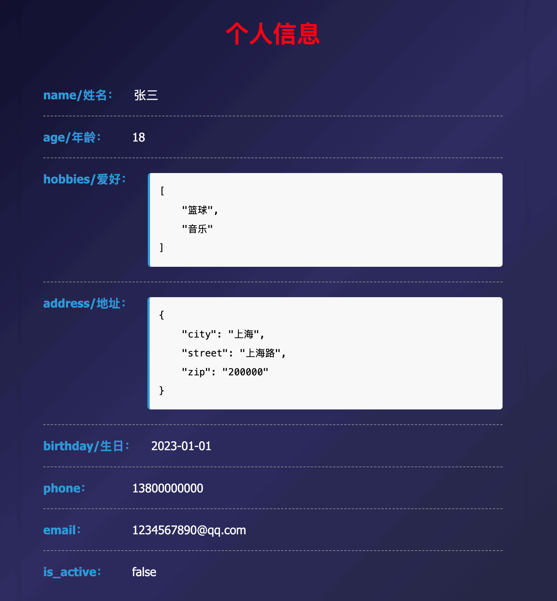
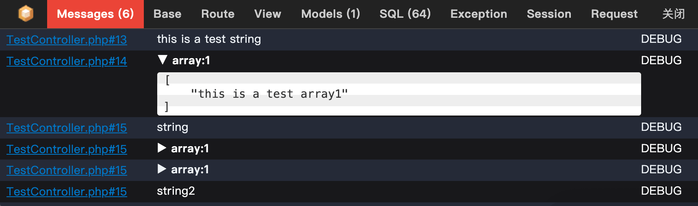
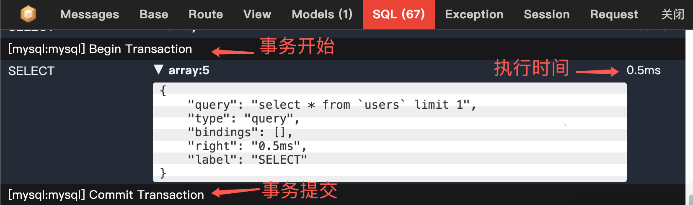
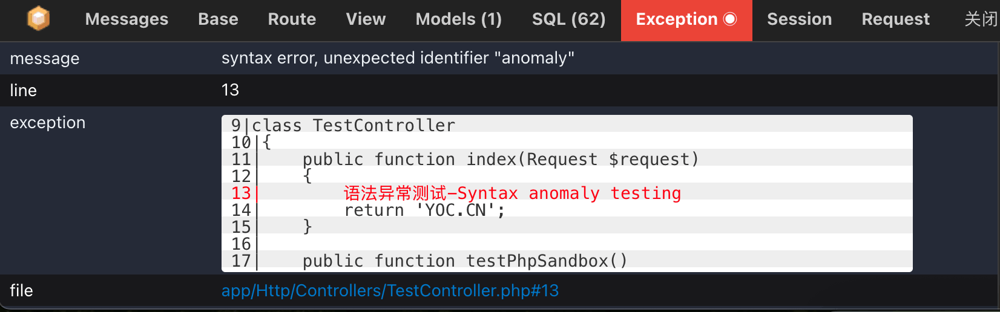

# 系统追踪调试工具 Trace

> 基于 Laravel 11+ 和 PHP 8.2+ 开发的强大调试工具，提供 SQL 分组、性能分析、异常追踪等全方位调试能力。

## 功能特性

- 🎯 **SQL 智能分组** - 自动将缓存和会话相关的 SQL 语句分组展示，支持手风琴式展开/收起
- 🔍 **代码追踪调试** - 使用 `trace()` 函数快速调试任意变量
- 📊 **性能监控** - 实时显示请求时间、内存消耗、SQL 查询时间等
- 🚨 **多层次异常处理** - 四层异常保护机制，确保任何情况下都能显示友好错误页面
  - 第1层：Laravel 11+ `withExceptions()` 集成
  - 第2层：传统异常处理器（Laravel 10及以下）
  - 第3层：兜底异常处理器（引导阶段错误、服务提供者异常）
  - 第4层：紧急渲染器（Laravel 完全不可用时的最后保障）
- 💥 **极端情况保护** - 文件缓存损坏、内存耗尽、PHP 致命错误等极端情况下的优雅降级
- 🎨 **现代化界面** - 响应式设计，适配移动端和桌面端
- ⚡ **零配置开箱即用** - 无需复杂配置，开箱即用
- 🎭 **精美视图模板** - 提供统一、美观的错误和调试页面模板

## 配置定义【可选】

发布 `config/trace.php` 配置文件，所有的配置项都可以不定义或者直接不创建配置文件，则会自动使用默认配置项；

```bash
php artisan vendor:publish --provider="zxf\Trace\Providers\TraceServiceProvider"
```

### 配置选项

```php
return [
    /**
     * 是否开启 trace 调试功能
     * 默认: true
     */
    'enabled' => true,

    /**
     * 使用自定义处理的命名空间
     * 例如在 App\Exceptions\Handler->render 中自定义处理 Trace 检测到的异常
     * 默认: Modules
     */
    'namespace' => 'Modules',

    /**
     * 自定义处理 Trace 调试产生的数据
     * 默认: 空
     * 
     * 示例:
     * 'end_handle_class' => \App\Services\TraceEndService::class,
     */
    'end_handle_class' => '',

    /**
     * 代码追踪调试使用的编辑器
     * 默认: phpstorm
     * 
     * 支持: "phpstorm", "vscode", "vscode-insiders", "vscode-remote",
     *       "vscode-insiders-remote", "vscodium", "textmate", "emacs",
     *       "sublime", "atom", "nova", "macvim", "idea", "netbeans",
     *       "xdebug", "espresso"
     */
    'editor' => 'phpstorm',
];
```

### 异常处理配置

```php
return [
    // ... 其他配置

    /**
     * 兜底错误处理配置
     *
     * 用于配置在 Laravel 框架无法正常工作时（如引导阶段异常、致命错误）的错误处理行为
     */
    'fallback_handler' => [
        // 是否启用兜底错误处理器
        'enabled' => true,

        // 是否在调试模式下也启用兜底处理器
        'force_enabled' => false,

        // 是否在响应中包含请求ID
        'include_request_id' => true,

        // 自定义错误页面路径
        'custom_error_view' => '',

        // 紧急日志配置
        'emergency_log' => [
            'enabled' => true,
            'path' => 'logs/emergency',
            'retention_days' => 7,
        ],
    ],
];
```

## 启用条件

Trace 调试功能的启用条件（可查看 `is_enable_trace` 函数）：

1. **CLI 环境下直接关闭** - 命令行执行时不显示调试信息
2. **最高优先级** - 手动定义了 `app.trace` 配置参数时使用该配置
3. **默认判断** - 当 APP_ENV 不是 production（生产环境）或 APP_DEBUG=true，且不是 AJAX 请求时启用

## 一、数据调试

### 响应/输出 视图/数据

```php
$title = '个人信息';
$list = [
    'name/姓名' => '张三',
    'age/年龄' => 18,
    'hobbies/爱好' => ['篮球', '音乐'],
    'address/地址' => [
        'city' => '上海',
        'street' => '上海路',
        'zip' => '200000',
    ],
    'birthday/生日' => '2023-01-01',
    'phone' => '13800000000',
    'email' => '1234567890@qq.com',
    'is_active' => false,
];

// 输出调试 HTML
app('trace')->outputDebugHtml($list, $title);

// 响应输出 JSON
app('trace')->respJson($message, $code)->send();

// 响应输出视图
app('trace')->respView($message, $code)->send();
```

<p align="center"><a href="https://www.yoc.cn" target="_blank"></a></p>

### 代码调试

使用辅助函数 `trace` 进行调试：

```php
// 支持任意个不同类型的参数
trace('this is a test string');
trace(['this is a test array1']);
trace('string', ['array1'], ['array2'], 'string2');
```

**说明：** 如果是普通的 GET 请求（非 AJAX 请求），会直接在页面底部展示调试信息；如果是其他请求，会记录到 Laravel 的本地日志文件中，以日志的方式呈现。

<p align="center"><a href="https://www.yoc.cn" target="_blank"></a></p>

### SQL 智能分组

系统会自动识别并分组以下类型的 SQL 语句：

1. **缓存查询** - 包含 `cache` 表名或 `cache_key`、`cache_value` 字段的查询
2. **会话查询** - 包含 `sessions` 表名或 `session_id`、`payload` 字段的查询
3. **业务查询** - 其他所有 SQL 查询

**分组特性：**
- 🎨 不同类型分组使用不同的颜色标识
- 🔄 手风琴式展开/收起，默认展开
- 📊 显示每个分组内的 SQL 条数
- ⚡ 点击分组标题即可切换显示状态

**示例代码：**

```php
public function test(Request $request)
{
    try {
        DB::beginTransaction();
        
        // 业务查询 - 不会分组
        DB::table('users')->where('id', 1)->first();
        
        // 缓存查询 - 自动分组到"缓存查询"
        DB::table('cache')->where('key', 'user_1')->first();
        DB::table('cache_2024')->where('key', 'settings')->first();
        
        // 会话查询 - 自动分组到"会话查询"
        DB::table('sessions')->where('id', session()->getId())->first();
        DB::table('sessions')->where('user_id', auth()->id())->first();
        
        DB::commit();
        return '';
    } catch (\Exception $exception) {
        DB::rollback();
        return $this->error([
            'code' => 500,
            'message' => $exception->getMessage(),
        ]);
    }
}
```

<p align="center"><a href="https://www.yoc.cn" target="_blank"></a></p>

### 异常追踪

```php
public function test(Request $request)
{
    语法异常测试-Syntax anomaly testing
    return 'YOC.CN';
}
```

<p align="center"><a href="https://www.yoc.cn" target="_blank"></a></p>

## 二、Laravel 11+ 优雅接管异常处理

### 接入

在引导文件 `bootstrap/app.php` 中接入异常处理：

> 引入 `zxf/trace` 包后，默认会自动处理 Laravel 的异常。

```php
->withExceptions(function (Exceptions $exceptions): void {
    // 此处可以空着，什么代码都不需要写，zxf/trace 包就会自动处理
    // 仅在需要对某个或某些(例如：[500],[401,500])错误码进行特殊处理(例如401自定义跳转逻辑)或者定义不需要被报告的异常类列表时可自定义处理
})
```

#### 默认模式

```php
->withExceptions(function (Exceptions $exceptions): void {
   // 异常处理类
   \zxf\Trace\CustomExceptionHandler::handle($exceptions);
})
```

#### 自定义处理指定错误码

```php
->withExceptions(function (Exceptions $exceptions): void {
    // 接入异常处理类 - 自定义处理部分异常状态码的逻辑
    /**
     * 初始化 Laravel 11+ 异常处理类
     *
     * @param  Exceptions  $exceptions  Laravel 11+ 异常类
     * @param  Closure|null  $customHandleCallback  想要自定义处理的回调函数：回调 ($code, $message);
     * @param  array  $customHandleCode  需要自定义回调处理的错误码；空表示由接管所有的错误码回调处理，不为空表示只接管指定的错误码回调处理；eg: [401], [401,403]
     * @param  array  $dontReport  不需要被报告的异常类列表
     */
    // 接入异常处理类
    \zxf\Trace\CustomExceptionHandler::handle($exceptions, function ($code, $message, $exception) {
            if ($code == 401) {
                return to_route('login');
            }
        }, 
        [401, 403], // 需要自定义处理的异常状态码,为空表示处理所有的异常状态码
        [
            // 定义不需要报告的异常类
            // Your\Path\InvalidException::class
        ]
    );
})
```

### 异常日志处理

定义好 Laravel 默认的日志处理 `Illuminate\Support\Facades\Log`，异常日志走定义好的默认渠道，默认渠道记录异常时才走本地日志渠道 `stack`。

```php
use Illuminate\Support\Facades\Log;

// 记录日志
try {
    Log::error($message, $content);
} catch (Throwable $err) {
    // 写入本地文件日志
    Log::channel('stack')->error($message, $content);
}
```

### 自定义错误视图

#### 使用 Trace 包内置视图

Trace 包提供了精美的错误页面模板，无需任何配置即可使用。支持以下状态码：
- 403 - 禁止访问
- 404 - 页面未找到
- 500 - 服务器错误
- 503 - 服务不可用
- 通用错误页面（其他状态码）

#### 视图使用指南

Trace 包提供以下视图模板：

| 视图名称 | 用途 | 说明 |
|---------|------|------|
| `trace::error` | 错误页面 | 展示 HTTP 错误信息，支持调试模式 |
| `trace::debug` | 调试页面 | 展示调试信息列表 |
| `trace::panel` | 调试面板 | **仅限内部使用**，页面底部调试工具栏 |

**使用示例：**

```php
// 在控制器中返回错误页面
return response()->view('trace::error', [
    'code' => 404,
    'title' => '页面未找到',
    'message' => '您访问的页面不存在',
    'isDebug' => config('app.debug'),
]);

// 展示调试信息
return response()->view('trace::debug', [
    'title' => '调试信息',
    'list' => [
        ['type' => 'text', 'label' => '用户名', 'value' => 'admin'],
        ['type' => 'code', 'label' => '配置', 'value' => json_encode($config)],
    ],
]);
```

**视图数据参数：**

`trace::error` 视图接受以下参数：
- `code` - HTTP 状态码 (默认: 500)
- `title` - 错误标题 (默认: 'Error')
- `message` - 错误消息 (默认: 'An error occurred')
- `isDebug` - 是否调试模式 (默认: false)
- `exception` - 异常对象 (可选，调试模式显示)
- `list` - 调试信息列表 (可选，调试模式显示)
- `requestId` - 请求 ID (可选)
- `timestamp` - 时间戳 (可选)

`trace::debug` 视图接受以下参数：
- `title` - 页面标题 (默认: 'Debug')
- `list` - 调试信息列表，每项包含 `type`, `label`, `value`
  - `type` 可选值: `text`, `code`, `code_html`, `debug_file`

#### 自定义 Trace 包视图

如果需要自定义 Trace 包的错误页面，可以发布视图文件：

```bash
php artisan vendor:publish --provider="zxf\Trace\Providers\TraceServiceProvider" --tag="trace-views"
```

发布后，视图文件将复制到 `resources/views/vendor/trace/` 目录，您可以自由修改这些视图。

#### 视图命名空间

Trace 包注册了 `trace::` 视图命名空间，可以直接使用：

```blade
{{-- 使用 Trace 包的错误页面 --}}
@extends('trace::error')

{{-- 在视图中包含错误组件 --}}
@include('trace::error', ['code' => 404, 'message' => '页面不存在'])
```

#### 视图访问保护

> **注意：** `trace::panel` 视图为 Trace 包内部专用，外部代码直接调用会抛出异常。如需自定义调试面板外观，请通过 CSS 覆盖样式。

#### 完全自定义错误视图

在 `config/trace.php` 中配置自定义视图路径：

```php
'fallback_handler' => [
    // 自定义错误视图路径（相对于 resources/views）
    'custom_error_view' => 'errors.my-custom-error',
],
```

然后在 `resources/views/errors/my-custom-error.blade.php` 中创建视图：

```blade
@extends('layouts.app')

@section('content')
<div class="error-container">
    <h1>{{ $code }}</h1>
    <p>{{ $message }}</p>
    <a href="/">返回首页</a>
</div>
@endsection
```

## 三、高级功能

### 3.1 自定义 Trace 数据处理

可以通过配置 `end_handle_class` 来自定义处理 Trace 产生的数据：

```php
// config/trace.php
return [
    'end_handle_class' => \App\Services\TraceEndService::class,
];

// app/Services/TraceEndService.php
namespace App\Services;

use Illuminate\Support\Facades\Log;

class TraceEndService
{
    public function handle(array $trace = []): void
    {
        // 自定义处理逻辑
        // 例如：发送到外部监控系统
        // Log::channel('stack')->debug("===== [Trace]调试: ===== ", $trace);
    }
}
```

### 3.2 响应式设计

Trace 调试面板完全支持响应式设计：

- **桌面端** - 完整功能展示，支持多列布局
- **移动端** - 自动适配小屏幕，单列布局，优化触摸交互
- **平板端** - 智能调整布局，平衡空间和功能

### 3.3 键盘快捷键

- **ESC** - 关闭调试面板

### 3.4 编辑器集成

支持多种编辑器，点击文件路径可直接跳转到编辑器对应位置：

- PhpStorm
- VS Code
- Sublime Text
- Atom
- 等其他编辑器

配置方式（在 `config/trace.php` 中）：

```php
'editor' => 'phpstorm', // 或 'vscode', 'sublime', 'atom' 等
```

## 四、性能优化

### 4.1 Opcache 预加载

为了获得最佳性能，可以使用 Opcache 预加载功能。在 `php.ini` 中添加：

```ini
opcache.preload=/path/to/vendor/zxf/trace/preload.php
opcache.preload_user=www-data
```

预加载会将 Trace 包的核心文件编译并保持在内存中，显著减少请求响应时间。

### 4.2 配置缓存

Trace 包自动缓存配置读取结果，避免重复调用 `config()` 函数：

```php
// 配置缓存会自动生效，无需手动操作
// 如需清除配置缓存（例如配置变更时）：
\zxf\Trace\Handle::clearConfigCache();
```

### 4.3 SQL 分组缓存

SQL 分组模式会被缓存，避免每次请求都重新编译正则表达式：

```php
// 缓存会自动生效
// 如需清除 SQL 分组缓存：
\zxf\Trace\Handle::clearConfigCache(); // 同时清除配置和 SQL 分组缓存
```

### 4.4 内存管理

- 请求级别的数据隔离，避免内存泄漏
- 自动清理已处理的请求数据
- 静态属性优化，减少内存占用
- 反射缓存自动清理机制
- 请求跟踪数量限制（默认 1000 条）

### 4.5 性能监控

自动收集并展示以下性能指标：

- 请求总耗时
- SQL 查询总耗时
- 内存消耗
- 吞吐率（req/s）
- 磁盘使用情况（非 Windows 系统）
- 缓存命中率

### 4.6 前端性能优化

前端 JavaScript 进行了以下优化：

- DOM 元素缓存，减少重复查询
- JSON 解析结果缓存
- 事件委托优化
- 防抖处理优化（300ms）

### 4.7 SQL 优化

- 自动检测重复 SQL
- 分组展示缓存和会话查询
- 显示查询执行时间
- SQL 长度限制（默认 1500 字符）
- 绑定参数数量限制（默认 50 个）

## 五、安全特性

### 5.1 数据脱敏

- 数据库连接信息自动脱敏
- IP 地址脱敏显示
- 敏感信息自动过滤

### 5.2 XSS 防护

所有输出内容经过 HTML 转义处理，防止 XSS 攻击。

### 5.3 路径验证

增强的目录遍历保护，防止恶意路径访问。

## 六、兼容性

### 6.1 Laravel 版本

- Laravel 12.x ✅
- Laravel 11.x ✅
- Laravel 10.x ✅
- Laravel 9.x ✅

### 6.2 PHP 版本

- PHP 8.2 ✅
- PHP 8.1 ✅
- PHP 8.0 ✅

### 6.3 运行环境

- Apache ✅
- Nginx ✅
- Swoole ✅
- Octane ✅

## 七、常见问题

### Q1: 为什么我的页面看不到 Trace 面板？

**A:** 检查以下几点：
1. 确认不是生产环境（APP_ENV != production）或 APP_DEBUG=true
2. 确认不是 AJAX 请求
3. 确认配置文件中 `enabled` 为 `true`
4. 确认不是命令行执行

### Q2: SQL 分组功能如何使用？

**A:** SQL 分组是自动的，系统会识别包含以下特征的 SQL：
- 缓存表：`cache`、`cache_*` 或包含 `cache_key`、`cache_value`
- 会话表：`sessions` 或包含 `session_id`、`payload`、`user_id`

### Q3: 如何自定义 SQL 分组规则？

**A:** 可以修改 `Handle.php` 中的 `getSqlInfo()` 方法，在 `$groupPatterns` 数组中添加自定义规则。

### Q4: Trace 会影响生产环境性能吗？

**A:** 不会，Trace 只在非生产环境或调试模式下启用，生产环境会自动关闭。

### Q5: 如何禁用特定类型的 SQL 监听？

**A:** 可以在配置文件中添加自定义配置，然后在 `listenSql()` 方法中根据配置过滤。

## 八、更新日志

### v2.2.0 (2025-04)

**异常处理增强：**
- 🛡️ **四层异常保护机制** - 确保任何情况下都能显示友好错误页面
- 🆘 **EmergencyRenderer** - 零依赖紧急渲染器，Laravel 完全不可用时也能工作
- 🔧 **FallbackExceptionHandler** - 兜底异常处理器，捕获引导阶段和致命错误
- 💾 **SafeStorage** - 安全存储操作类，缓存/文件操作异常时自动降级
- 📝 **紧急日志系统** - Laravel 日志不可用时自动写入紧急日志
- 🎨 **独立错误页面模板** - 不依赖 Laravel 视图系统的精美错误页面

**极端情况保护：**
- 🗄️ 文件缓存损坏自动检测和清理
- 💥 PHP 致命错误（Fatal Error）优雅处理
- 🔌 内存耗尽（Out of Memory）保护
- 🔨 编译错误（Compile Error）捕获
- ⚙️ 服务提供者异常处理
- 📋 配置加载异常处理

**改进：**
- 🔧 错误页面支持多种格式（HTML/JSON/纯文本）
- 🔧 自动检测客户端期望的响应格式
- 🔧 生产环境友好的错误消息
- 🔧 调试模式下显示详细堆栈跟踪

### v2.1.0 (2025-04)

**性能优化：**
- ⚡ 添加 Opcache 预加载支持
- ⚡ 配置缓存机制，减少重复 config() 调用
- ⚡ SQL 分组模式缓存，避免重复正则编译
- ⚡ 数学计算优化（bcadd/bcsub/bcdiv → 普通运算符）
- ⚡ 前端 DOM 缓存和 JSON 解析缓存
- ⚡ 输出缓冲优化 HTML 渲染
- ⚡ 移除不必要的反射调用

**新功能：**
- ✨ 性能监控类 `PerformanceMonitor`
- ✨ 请求跟踪自动清理机制
- ✨ 缓存命中率统计

**改进：**
- 🔧 内存管理优化（限制最大跟踪请求数）
- 🔧 反射缓存自动清理
- 🔧 编辑器配置静态缓存

### v2.0.0 (2025)

**新功能：**
- ✨ SQL 智能分组功能
- ✨ 手风琴式分组展示
- ✨ 响应式展开按钮优化
- ✨ 移动端适配优化

**改进：**
- 🔧 代码质量提升（Laravel 11+ 和 PHP 8.2+ 标准）
- 🔧 文档完善
- 🔧 性能优化
- 🔧 安全增强

**修复：**
- 🐛 修复展开按钮在小屏幕下不显示的问题
- 🐛 修复内存泄漏问题
- 🐛 修复 SQL 参数替换顺序问题

## 九、贡献指南

欢迎贡献代码、报告 Bug 或提出新功能建议！

### 开发环境设置

```bash
# 克隆仓库
git clone https://github.com/yourusername/trace.git
cd trace

# 安装依赖
composer install

# 运行测试
composer test
```

### 代码规范

- 遵循 PSR-12 编码规范
- 使用 PHP 8.2+ 特性
- 所有方法必须添加 PHPDoc 注释
- 测试覆盖率需达到 80% 以上

## 十、文档

### 详细文档

- [异常处理文档](docs/EXCEPTION_HANDLING.md) - 深入了解四层异常保护机制
- [视图文档](docs/VIEWS.md) - 所有 Blade 视图的详细使用指南

## 十一、许可证

MIT License

## 十二、联系方式

- 官网: http://www.yoc.cn

---

<p align="center">
  <strong>本页面由 <a href="http://www.yoc.cn/" target="_blank">yoc.cn</a> 提供支持</strong>
</p>
